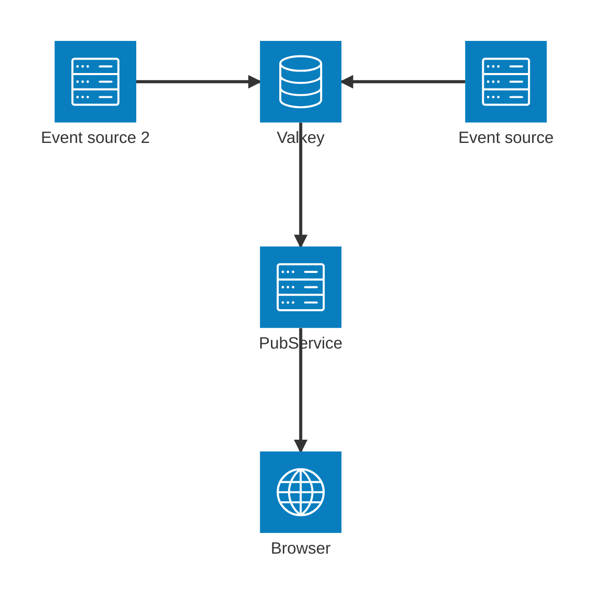

## Подписка из браузера на pub/sub valkey

пример сервиса - **main.py**

пример клиента - **redis_demo.html**

compose - файл для запуска valkey в каталоге **valkey**

публиковать в redis/vallkey можно любым подходящим для этого средством, например [Redis Insight](https://github.com/redis/RedisInsight). 

