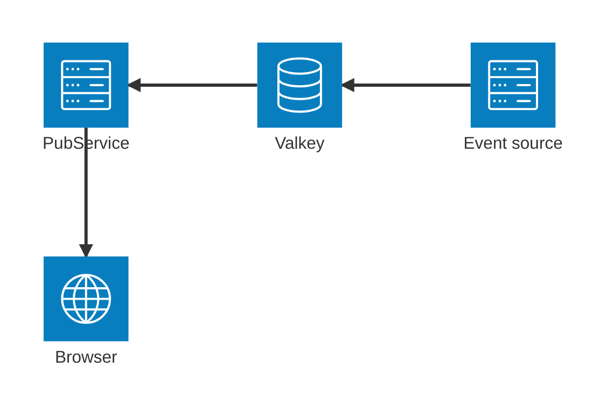

## Подписка из браузера на pub/sub vallkey

пример сервиса - **main.py**

пример клиента - **redis_demo.html**

публиковать в redis/vallkey можно любым подходящим для этого средством, например _Redis Insight_. 

